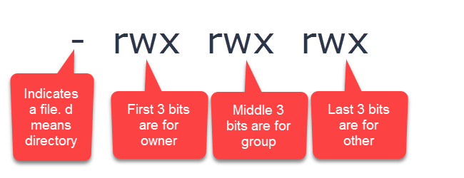

# Day 4: Important Linux commands for working with ROS

In this note, you will see some extra commands that you require when working with 
ROS.

# Video Lecture

[](https://drive.google.com/file/d/1HNPYzO9iuphNvDk9CDqoHpaQx06vEHB9/view?usp=sharing)

# Q&A 

[Q&A start from here](https://youtu.be/JAojwkjGSDU?t=5814)

## Linux Architecture

The following diagram shows the core components of the Linux operating system


## Linux Terminologies

1. [**Kernel**](https://www.geeksforgeeks.org/difference-between-operating-system-and-kernel/)
: It is the core part of an operating system. It can closely interact with hardware. It is basically a computer program which is doing resource management, device management, task scheduling, multi-tasking and multi-user handling 

2. [**Shell**](https://www.geeksforgeeks.org/introduction-linux-shell-shell-scripting/): A shell is special user program which provide an interface to user to use operating system services. Shell accept human readable commands from user and convert them into something which kernel can understand. It is a command language interpreter that execute commands read from input devices such as keyboards or from files. The shell gets started when the user logs in or start the terminal.

3. [**Terminal**](https://www.geeksforgeeks.org/introduction-linux-shell-shell-scripting/): Program which provides command line interface to the shell
4. **List of GUI Shell**: BASH (Bourne Again Shell), C SH( C shell)
5. [**Shell Scripting**](https://www.tutorialspoint.com/unix/shell_scripting.htm): A shell can take commands as input from a file and it can execute them in shell to avoid the repetition work. These files are called Shell scripts.
6. [**Linux Distributions**](https://en.wikipedia.org/wiki/Linux_distribution): Different flavours of GNU/Linux
7. [**Desktop Environement**](https://en.wikipedia.org/wiki/Desktop_environment): Set of program offers a desktop environement. We can also call this a Graphical shell.
8. [**GNOME**](https://www.gnome.org/): It is a free & open-source desktop environment for Linux operating system
9. [**KDE**](https://kde.org/): K Desktop environment, very similar to Windows desktop
10. [**Unity Desktop in Ubuntu**](https://en.wikipedia.org/wiki/Unity_(user_interface)): Not a desktop environment, but it is a graphical shell for the GNOME which is developed by Canonical for Ubuntu.
11. **Root User and Root directory**: Root user is the adminstration in Linux operating system and Root directory is top most directory in Linux where Linux system files are stored. 
12. **Package manager**: Software helps to install Linux packages. Example of package managers are [apt](https://en.wikipedia.org/wiki/APT_(software)) and [snap](https://snapcraft.io/)
13. **Debian binary packages**: The .deb file which is called a debian package, which can install a pre-built application.
## List of GNU/Linux commands

### 1. tree: Display hierarchy of all the folders

Install tree command using following command
```
sudo apt install tree
```
Usage
```
tree <folder name>
```
Example


### 2. touch: Update the timestamp of a file/Create a file

Usage
```
touch <file name>
```
Example


### 3. gedit: Open a new file in GUI based text editor

Usage
```
gedit <file name>
```
Example


### 4. ls -la: List the file with permission

Usage
```
ls -la
```

The parameter shown in the left is the permission of a file
For example, **-rw-r--r--**

1. **Read**: Denoted by the letter r. This means that the user can read the file or directory.
2. **Write**: Denoted by the letter w. This means that the user can write or modify the file or directory.
3. **Execute**: Denoted by the letter x. This means that the user can execute the file.
There are also three different user permission groups:

```
Owner: That’s me.

Group: Whatever group the file or directory was assigned to.

All Users: This permission group includes the rest of the users.
```

1. Owner has read and write privileges (i.e. rw-)
2. The group has read privileges (i.e. r–)
3. All other users have only read privileges (r–).

Example





### 4. chmod: Change Mode,Changing permission of a file

Usage
```
chmod [reference][operator][mode] <file_name>_
```

Example
```
chmod +x test.txt, will change the permission to executable
```


### 5. export and echo: Helps to store and display a variable in a shell

Usage of export
```
export variable_name=value
```

Usage of echo

```
echo $variable_name
echo "Text"
```

Example

```
export ROS_PATH=/opt/ros
echo $ROS_PATH
```


## Linux Shell Script

Hellow world shell script

**first.sh**: Print hello world

```
#!/bin/bash
# This is a comment!
echo Hello World        # This is a comment, too!
```

**Running shell script**

The 755 permission


```
chmod 755 first.sh  
or
chmod +x first.sh
./first.sh

Output: Hello World
```

**second.sh**: Read your name and print with a message

```
#!/bin/bash
echo "Enter Your Name"
read name
echo "Welcome $name to Robocademy"
```

**Running shell script**

```
chmod 755 second.sh  
or
chmod +x second.sh

./second.sh

Output: Enter your name
Lentin
Welcome Lentin to Robocademy
```

**third.sh**: Read a value from command line 

```
#!/bin/bash

arg1=$1
echo "Your value is $arg1"
```

**Running shell script**

```
chmod +x third.sh
./third.sh 123

Output: Your value is 123
```

**fourth.sh**: export variables and echoing it

```
#!/bin/bash

export ROS="Robot Operating System"
echo $ROS
```
**Running shell script**

```
chmod +x fourth.sh
./fourth.sh

Output: Robot Operating System"

```

## The .bashrc file

It is a shell script executing when a new terminal session starts. It is present in /home/<user_name>/folder.

**Opening .bashrc file**

```
gedit ~/.bashrc
```

### source command: Execute commands from a file in the current terminal

Usage

```
source file_name
```

Application: Sourcing environment variables in the current terminal

Example: Sourcing bashrc

```
source ~/.bashrc

```
Example: Sourcing fourth.sh


## The SSH: Secure shell

Secure protocol for to a remote computer. Useful while connecting to Raspberry Pi, and robot PC.

Installing ssh

```
sudo apt update
sudo apt install openssh-server
```

After installing check the status 

```
sudo systemctl status ssh
```


```
sudo ufw allow ssh #UFW: Uncomplicated Firewall

ssh

```


**Usage**

```
ssh <user>@<host>

```
**Example**
```
ssh pi@192.168.0.17
```


## Reference links

1. [Automatic Addison](https://automaticaddison.com/the-complete-guide-to-linux-fundamentals-for-robotics/)
2. [edureka Linux tutorial](https://www.edureka.co/blog/linux-tutorial/)
3. [Shell script reference](https://www.shellscript.sh/variables1.html)
