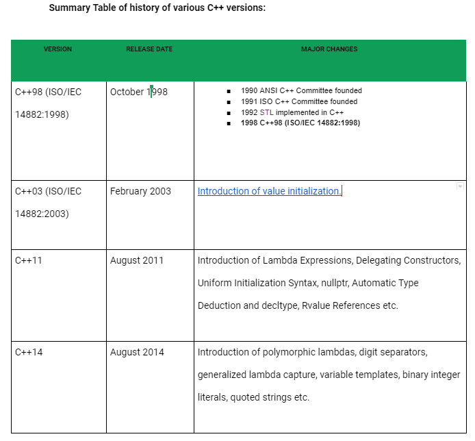
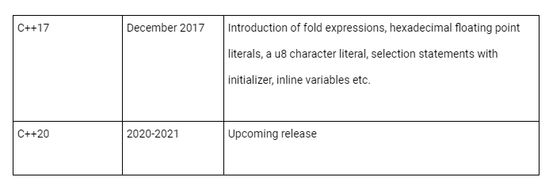
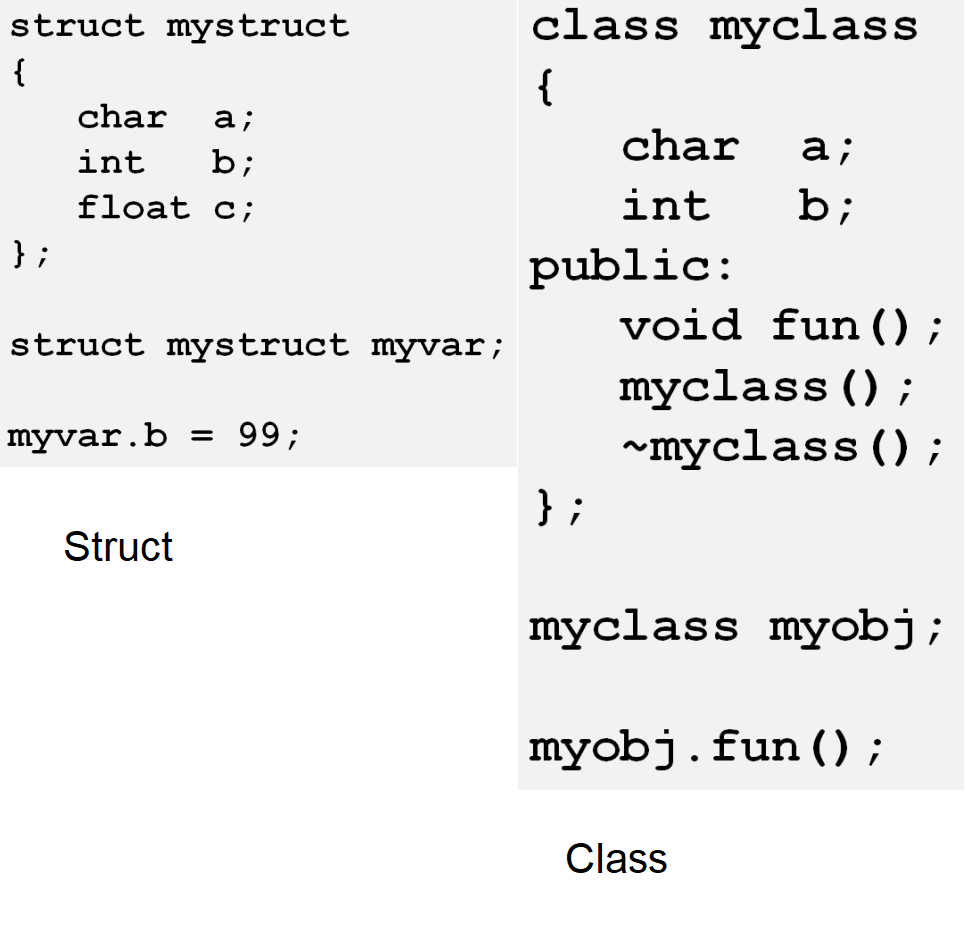
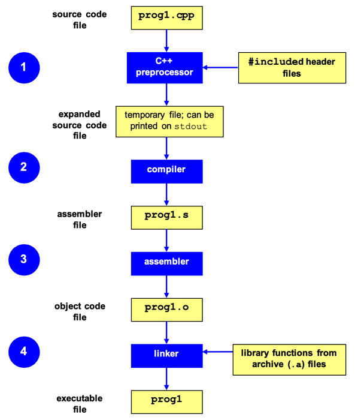

# Day 5: Learning C++ for ROS
In this class, we will discuss about the basics of C++ in Ubuntu/Linux which required for working with ROS.

## Video Lecture


[](https://drive.google.com/file/d/19KCC-PMUnaXEVkB_wk_BM1w0jkSIhY8m/view?usp=sharing)
## Q&A

[Q&A starts from here](https://youtu.be/AyE2tD-Wj_g?t=6200)

## History of C++


[Source](https://www.geeksforgeeks.org/history-of-c/)





[Source](https://en.cppreference.com/w/cpp/language/history)

## Brush up your C++ Fundamentals

### Reference
1. [**Practice C++ online-W3Schools**](https://www.w3schools.com/cpp/default.asp)
2. [**C++ Fundamentals-Tutorialspoint**](https://www.tutorialspoint.com/cplusplus/)
3. [**C++ Fundamentals-GeeksforGeeks**](https://www.geeksforgeeks.org/cpp-tutorial/)

### C++ Books

1. [**Modern C++ for Absolute Beginners**](Reference/Modern_C++_Book.pdf)


## ROS Hello World C++ Code

1. **Why we learn C++ in this course?**
2. **What are the important concepts of C++ which are necessary to work with ROS?**

[Reference](http://wiki.ros.org/ROS/Tutorials/WritingPublisherSubscriber%28c%2B%2B%29)
```
#include "ros/ros.h"
#include "std_msgs/String.h"

#include <sstream>

int main(int argc, char **argv)
{

  ros::init(argc, argv, "talker"); 
  ros::NodeHandle n;  //Using C++ Class and Object
  ros::Publisher chatter_pub = n.advertise<std_msgs::String>("chatter", 1000); //Function templates and Object
  ros::Rate loop_rate(10);  //Class and Object
  int count = 0;
  while (ros::ok())
  {

    std_msgs::String msg;  //C Struct
    std::stringstream ss;
    ss << "hello world " << count;
    msg.data = ss.str();
    ROS_INFO("%s", msg.data.c_str());
    chatter_pub.publish(msg);  //Calling function from an Object
    ros::spinOnce();
    loop_rate.sleep();  //Calling function from an Object
    ++count;
  }

  return 0;
}


```

## Focus more on Object Oriented Concepts, Structures, Namespaces and Templates 

1. [**Class**](https://www.geeksforgeeks.org/c-classes-and-objects/): Building block of Object Oriented Programming. It is a user-defined data type which holds its own data members and member functions, which can be accessed and used by creating an instance of that class.
   
Comparison between Struct in C and Class in C++




2. **Object**: An Object is an instance of a Class. When a class is defined, no memory is allocated but when it is instantiated(i.e an object created)memory is allocated.

3. [**OOPs Concepts**](https://www.geeksforgeeks.org/object-oriented-programming-in-cpp/): Object-oriented programming � As the name suggests uses objects in programming. Object-oriented programming aims to implement real-world entities like inheritance, hiding, polymorphism, etc in programming. The main aim of OOP is to bind together the data and the functions that operate on them so that no other part of the code can access this data except that function.


4. [**Basics of C Structures**](https://www.geeksforgeeks.org/structures-c/): A struct in the C programming language is a composite data type declaration that defines a physically grouped list of variables under one name in a block of memory, allowing the different variables to be accessed via a single pointer or by the struct declared name which returns the same address.

5. [**Basics of C++ Namespaces**](https://www.geeksforgeeks.org/namespace-in-c/): A namespace is a declarative region that provides a scope to the identifiers (the names of types, functions, variables, etc) inside it. Namespaces are used to organize code into logical groups and to prevent name collisions that can occur especially when your code base includes multiple libraries.

Sample Code

```
#include <iostream> 
using namespace std; 

// Variable created inside namespace 
namespace first 
{ 
	int val = 500; 
} 

// Global variable 
int val = 100; 

int main() 
{ 
	// Local variable 
	int val = 200; 

	// These variables can be accessed from 
	// outside the namespace using the scope 
	// operator :: 
	cout << first::val << '\n'; 

	return 0; 
} 


```


6. [**Basics of C++ Templates**](https://www.geeksforgeeks.org/templates-cpp/):Templates are a feature of the C++ programming language that allows functions and classes to operate with generic types. This allows a function or class to work on many different data types without being rewritten for each one.


## Understand how to build a C++ program in Ubuntu/Linux

### Build Process

[Reference](http://faculty.cs.niu.edu/~mcmahon/CS241/Notes/build.html)




1. [**Understanding g++ compiler**](https://www.geeksforgeeks.org/compiling-with-g-plus-plus/)

Check g++ compiler version information:
```
g++ --version   

```
Compiling and create executable
```
g++ <code.cpp>

#Execute the program
./a.out   

#Mentioning name of the executable
g++ -o main hello.cpp  

#Execute the program
./main  
```


2. [**Basics of Linux Makefile**](http://www.cplusplus.com/articles/jTbCpfjN/)

Sample Makefile
```
#Makefile case 4
CC = g++
CFLAGS = -c
SOURCES =  main.cpp add.cpp
OBJECTS = $(SOURCES:.cpp=.o)
EXECUTABLE = main

all: $(OBJECTS) $(EXECUTABLE)

$(EXECUTABLE) : $(OBJECTS)
		$(CC) $(OBJECTS) -o $@  

.cpp.o: *.h
	$(CC) $(CFLAGS) $< -o $@

clean :
	-rm -f $(OBJECTS) $(EXECUTABLE)

.PHONY: all clean

```


3. [**Introduction to CMake**](https://medium.com/@rvarago/introduction-to-cmake-for-cpp-4c464272a239)

Sample CMakeLists.txt file

```
cmake_minimum_required(VERSION 3.0)

set(CMAKE_BUILD_TYPE Release)

set(CMAKE_CXX_FLAGS "${CMAKE_CXX_FLAGS} -std=c++14")

project(main)

add_executable(
	main 
	add.cpp 
	main.cpp
)
	
```

CMake For Beginners: Youtube Playlist

[](https://www.youtube.com/watch?v=_yFPO1ofyF0&list=PLK6MXr8gasrGmIiSuVQXpfFuE1uPT615s)


## Practice make perfect: Demo

We can practice some of basic C++ code here

1. [Hello World](code/hello_world.cpp) 
2. [Sum](code/sum.cpp) 
3. [Class Struct](code/class_struct.cpp) 
4. [Class Inherit](code/class_inherit.cpp)
5. [Read Write file](code/read_write_file.cpp)
6. [Exception Handling](code/exception.cpp)
7. [Namespace](code/namespace.cpp)

## Coding Style: Write simple and readable code 

1. [**ROS Developers Guide**](http://wiki.ros.org/DevelopersGuide)
2. [**ROS C++ Coding Style**](http://wiki.ros.org/CppStyleGuide)
