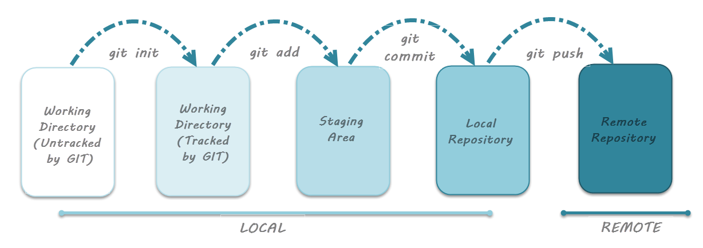
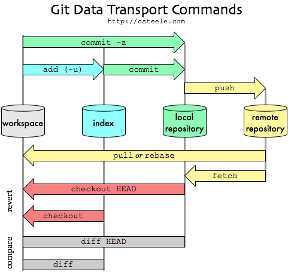

# Git Fundamentals

In this class, we are planning to discuss the fundamental concepts of Git, which is 
required to work with ROS. First we can start with answering two questions.

## Video Lecture

## Q&A

[Q & A Starts here ](https://youtu.be/vTXglXh1sJU?t=5386)

## Why Git for working with ROS?

1. **What is Git? and why we required this for working with ROS?**

**Ans:** [Git](https://git-scm.com/) is a distributed version control system, meaning while creating software you may able to records changes to your code over time, and you may able to recall a specific version later. For example, you have added a feature in your software and added it to the Git. The feature has some bugs, so using Git you can go back to your earlier changes and check, what went wrong. Git can be used for coordinating work among programmers. The main application is of course we can track changes in any set of files.

2. **What is the level of expertise in Git you require inorder to work with ROS?**

**Ans:** You only need basic expertise in Git. Your project has to keep in Git, so you have to learn how to create a repository in Git and how to push your code into it.
You may also want to clone some of the other packages which are created by other developers. So you should able to clone the repository and pull the changes whenever it required.

## Tutorials: Fundamentals of Git

* [What is version-control system and different types oF VCS](https://www.geeksforgeeks.org/version-control-systems/)
* [What is Subversion | SVN ](https://en.wikipedia.org/wiki/Apache_Subversion)
* [History of Git](https://en.wikipedia.org/wiki/Git)
* [Quick start with Git](https://guides.github.com/activities/hello-world/)
* [Git for beginner](https://www.atlassian.com/git/tutorials/what-is-version-control)
* [Git Fundamentals from Tutorial point](https://www.tutorialspoint.com/git/index.htm)
* [Git lifecycle](https://www.toolsqa.com/git/git-life-cycle/)
* [Creating a Github pages](https://guides.github.com/features/pages/)
* [Creating GitHub Profile README](https://www.aboutmonica.com/blog/how-to-create-a-github-profile-readme)
* [Configuring a remote for a fork](https://docs.github.com/en/github/collaborating-with-issues-and-pull-requests/configuring-a-remote-for-a-fork)

Video Tutorial: **What is git and Github**

[Youtube channel for learning Git](https://www.youtube.com/channel/UCP7RrmoueENv9TZts3HXXtw)

## Download Git Cheat Sheet

1. [Cheat Sheet 1](reference/git-cheat-sheet.pdf)

2. [Cheat Sheet 2](reference/github-git-cheat-sheet.pdf)

## Hand-on Tutorial 

1. **Creating a Git repository in Github**
2. **Configuring ssh keys**
3. **Writting Code and Pushing to Remote repository**
4. **What is a Git branch? and how to add and switch Git branches**
5. **Github star,watch,fork, Follow and Issues**
6. **Cloning a repository**
7. **Submitting a pull request to a repository**
8. **Creating Git pages and using a custom domain**

